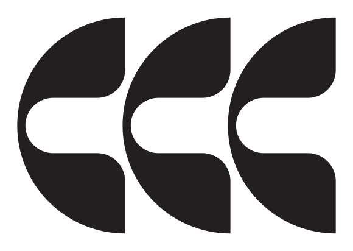
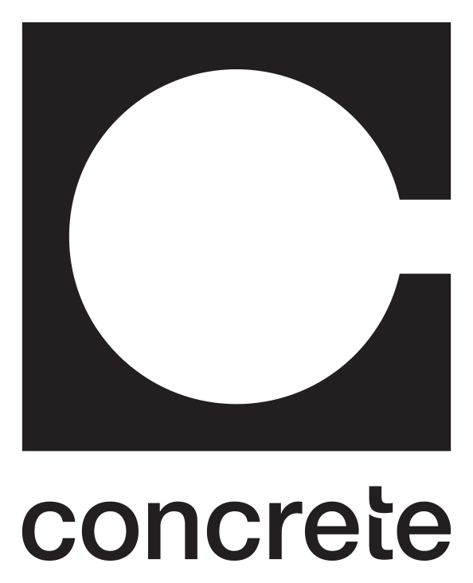
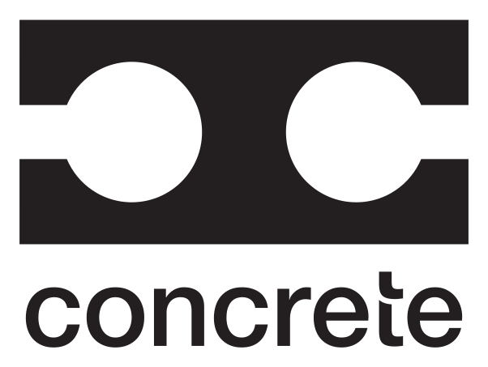
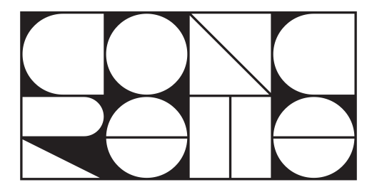
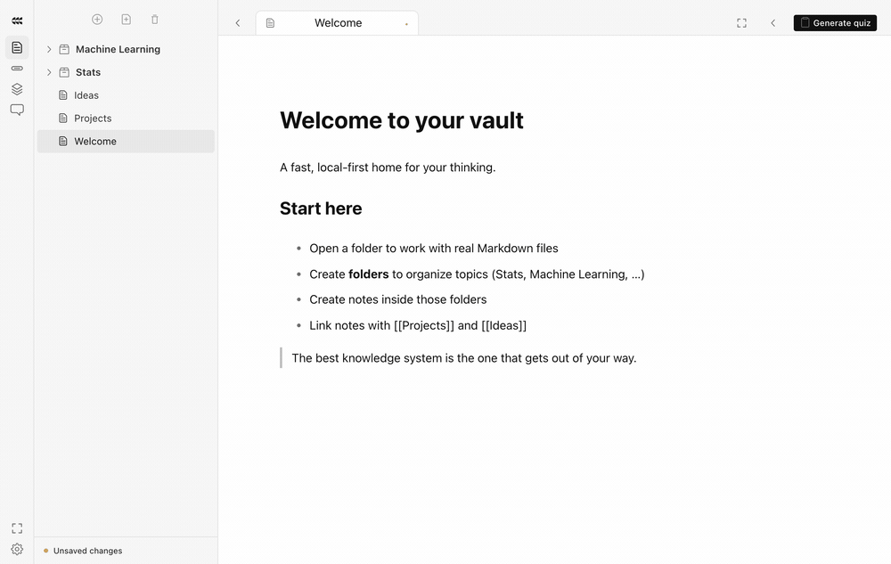
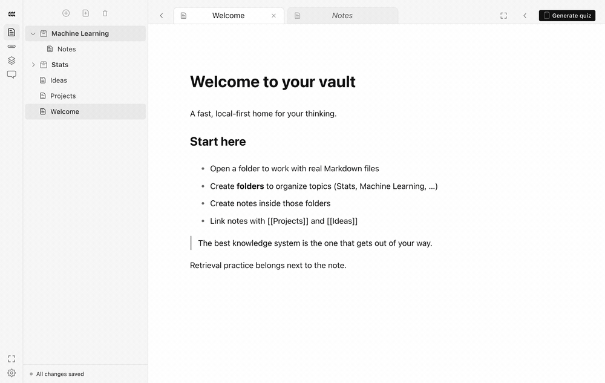
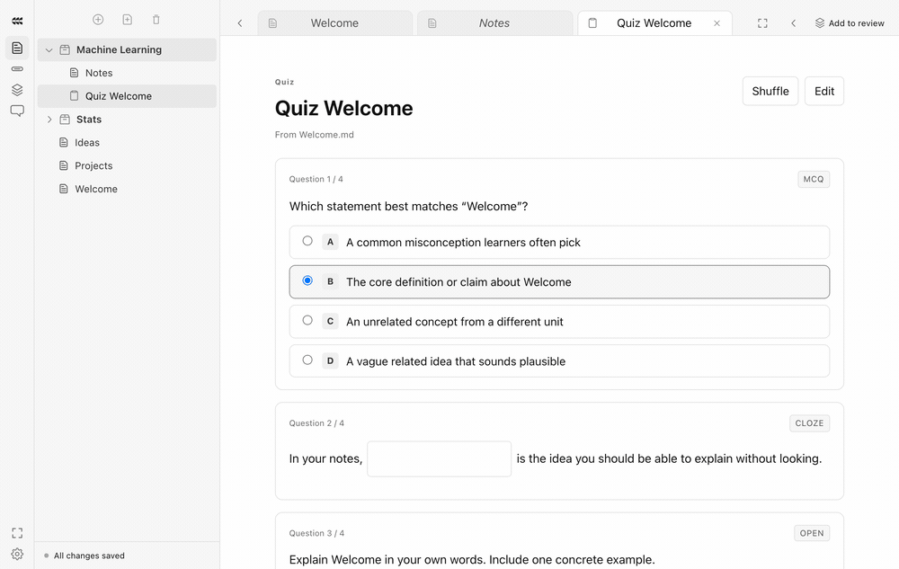
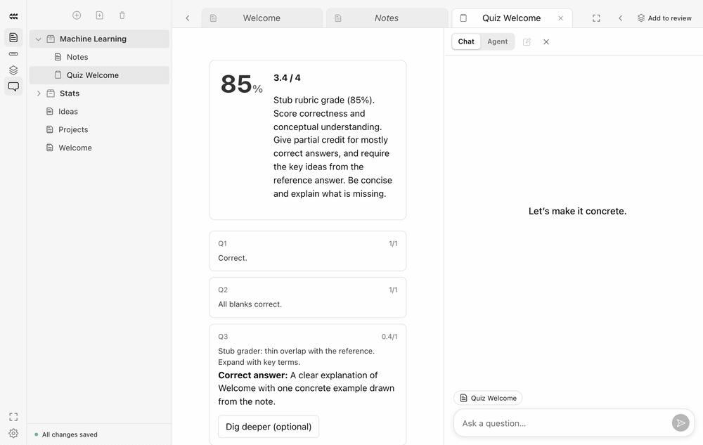

<p align="center">
  
  &emsp;&emsp;&emsp;
  
  &emsp;&emsp;&emsp;
  
  &emsp;&emsp;&emsp;
  
</p>

# Concrete

[](https://github.com/danielgraviet/concrete/stargazers)
[](https://github.com/danielgraviet/concrete/network/members)
[](https://github.com/danielgraviet/concrete/issues)
[](https://github.com/danielgraviet/concrete/commits/main)
[](https://www.apple.com/macos/)
[](https://github.com/danielgraviet/concrete/releases)

**Concrete is a local-first Markdown workspace for learning STEM subjects.** Write and organize notes as ordinary Markdown files, use AI to work with the material, and turn notes into active practice with generated quizzes.

> Built for students who want their notes, tools, and learning progress in one place.

[Get started](#getting-started) · [Contribute](#contributing) · [Report a bug](https://github.com/danielgraviet/concrete/issues/new) · [Request an idea](https://github.com/danielgraviet/concrete/issues/new)

## Notes

Write and organize notes as ordinary Markdown. Keep topics in folders, link related notes, and edit checklists in place.



## Quizzes

Generate a quiz from the note you have open. Answer multiple-choice, cloze, open, and code questions without leaving the app.



## Tutor

Ask about the open note. Explanations stay grounded in the material you are studying.



## Progress

After a quiz, see the score, skill breakdown, and recent activity.



## What it does

- **STEM notes in Markdown** — a fast editor for notes, math, code, PDFs, and linked topics. Your vault stays on disk and remains portable.
- **Grounded quiz generation** — generate multiple-choice, cloze, and code questions from current notes, then take and grade quizzes inside the app.
- **Tutor mode** — ask about the open note and get explanations grounded in the material you are studying.
- **Agent workflows** — connect a Codex or Claude agent that can inspect and edit vault files, generate learning materials, change themes, and report live progress.
- **Runnable code** — execute supported Python and other snippets in an isolated sandbox while studying. Outputs are shown in the editor and are not saved automatically.
- **Learning progress** — review quiz history, skill trends, streaks, and activity over time.
- **Local activity capture** — agent trajectories are stored as JSONL in `~/Documents/Concrete/agent-trajectories/` for later analysis and potential RL fine-tuning. They are not included in the Markdown vault view.

## Why Concrete?

Most note-taking tools stop at storage, and most AI tools are disconnected from the files and concepts you are trying to learn. Concrete keeps the source material local, makes the learning loop explicit, and treats retrieval practice as part of the workspace rather than a separate destination.

## Getting started

### Requirements

- macOS or 64-bit Linux (Ubuntu/Debian officially supported; other distributions can use the AppImage)
- Node.js 20 or newer
- For live quiz generation, tutoring, and agent workflows, one of:
  - the Claude Code CLI, logged in (Claude Pro/Max) or with an Anthropic API key,
  - the Codex CLI, logged in (ChatGPT plan) or with an OpenAI API key,
  - an OpenRouter API key (quizzes and tutoring only).

### macOS development install

Open Terminal (⌘ Space, type “Terminal”) and run each step. Already have Homebrew or Node 20+? Skip ahead.

**1. Install Homebrew** (the macOS package manager). It will ask for your password; nothing shows as you type.

```bash
/bin/bash -c "$(curl -fsSL https://raw.githubusercontent.com/Homebrew/install/HEAD/install.sh)"
```

On Apple Silicon Macs, add Homebrew to your PATH:

```bash
echo 'eval "$(/opt/homebrew/bin/brew shellenv)"' >> ~/.zprofile && eval "$(/opt/homebrew/bin/brew shellenv)"
```

**2. Install Node.js** (includes npm)

```bash
brew install node
```

**3. Download Concrete.** If macOS asks to install the Command Line Developer Tools for `git`, click Install, then run this again.

```bash
git clone https://github.com/danielgraviet/concrete.git && cd concrete
```

**4. Install dependencies.** `npm warn` lines are fine.

```bash
npm install
```

**5. Launch Concrete**

```bash
npm run dev
```

The Concrete window opens and creates your vault in `~/Documents/Concrete` on first launch. Quit with ⌘Q (or Ctrl C in Terminal).

### Open it again later

From now on, this is all you need:

```bash
cd concrete && npm run dev
```

<details>
<summary>Troubleshooting</summary>

- **`brew: command not found`**: run the PATH command from step 1, or open a new Terminal window.
- **Node is older than 20**: run `brew upgrade node`.
- **Window never appears**: make sure nothing else is using port 5173, then rerun `npm run dev`.
- **`npm install` permission errors**: don’t use `sudo`. Delete `node_modules` and run `npm install` again.

</details>

### Linux install (beta)

The quickest user install needs only `curl`—no Node.js, npm, Git, or sudo:

```bash
curl -fsSLO https://raw.githubusercontent.com/danielgraviet/concrete/main/scripts/install-linux.sh
sh install-linux.sh
rm install-linux.sh
```

This installs the latest x86_64 AppImage under your user account, adds a `concrete` terminal command, and creates an application-menu launcher. Run the same installer again to update.

To use a checked-out copy of this repository instead, run `./scripts/install-linux.sh`.

You can also download either Linux artifact from the release page:

- **Ubuntu or Debian:** install the `.deb` with `sudo apt install ./Concrete-*.deb`.
- **Other distributions:** mark the AppImage executable, then run it:

  ```bash
  chmod +x Concrete-*.AppImage
  ./Concrete-*.AppImage
  ```

Concrete creates its default vault in `~/Documents/Concrete`. Docker-backed code execution is optional; install Docker and make sure your user can access its daemon before enabling it. If you use the Codex or Claude agent, restart Concrete after installing its CLI so the desktop launcher can discover it.

### AI features

Open or create a Markdown vault, then use the quiz controls from a note to generate practice material. Pick the model backend under Settings → Tutor AI. Claude Code and Codex use your CLI login unless you save an API key; keys stay in the Electron main process.

### Build the desktop app

```bash
npm run build
npm run pack:mac
npm run pack:linux
```

The packaged app is written to `release/`.

## Contributing

Contributions from students, educators, and curious builders are welcome. You do not need to be an expert in Electron or AI to help—documentation, bug reports, UI polish, testing, and small improvements are all valuable.

1. Browse the [open issues](https://github.com/danielgraviet/concrete/issues), or open an issue describing a bug or idea before starting a larger change.
2. Fork the repository and create a focused branch using your initials:

   ```bash
   git checkout -b dg/fix-agent-workflow
   ```

3. Make your change and test it locally with `npm run build` and `npm test`.
4. Open a pull request explaining what changed, why it helps learners, and how you tested it.

Please keep pull requests small and focused when possible. Screenshots or short recordings are especially helpful for UI changes. Never commit API keys, personal vaults, private notes, or generated trajectory data.

### Good first contributions

- Improve onboarding or documentation
- Add or refine keyboard shortcuts
- Fix a small UI issue
- Improve quiz explanations or accessibility
- Add tests around parsing, notes, or learning workflows
- Try the app on a different Mac and report what you find

### Finding something to work on

Browse the [open issues](https://github.com/danielgraviet/concrete/issues) to find a feature, bug, design question, or documentation task. Issues labeled [`good first issue`](https://github.com/danielgraviet/concrete/labels/good%20first%20issue) are a good place to start. Other useful labels include `enhancement`, `bug`, `needs-design`, `ux`, `education`, `telemetry`, `documentation`, `accessibility`, `performance`, and `help wanted`.

Feature ideas should begin as issues so the community can discuss the problem and possible approaches. Once the direction is clear, implement the work on a branch using your initials—such as `dg/fix-agent-workflow`—and open a pull request that links back to the issue.

## Performance & footprint

Dev folders (`node_modules`, local `release/`) are large; end users mainly feel the DMG / `.app` size and App Support Chromium caches. See [docs/perf-baseline.md](docs/perf-baseline.md) for the scorecard, cold-start marks, and bundle analysis (`ANALYZE=1 npm run build`). Use `npm run clean` to wipe local pack artifacts.

## Project status

Concrete is an actively developed experimental desktop app. The core note, quiz, tutor, agent, and sandbox workflows are usable, while the learning analytics and trajectory dataset formats are still evolving. Expect APIs, file formats, and UI details to change.

## Community expectations

Be kind, assume good intentions, and make space for beginners. Feedback should be specific and respectful. If you are unsure whether an idea is in scope, open an issue and start a conversation.

## Privacy and safety

Concrete is designed around local Markdown files, but optional AI features send relevant content to the provider you configure. Review your provider's policies before using sensitive material, and do not put secrets or private coursework in prompts or issues.

## License

Concrete is released under the [MIT License](LICENSE). Contributions are welcome under the same license.
